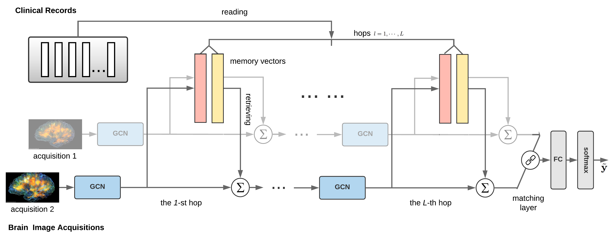
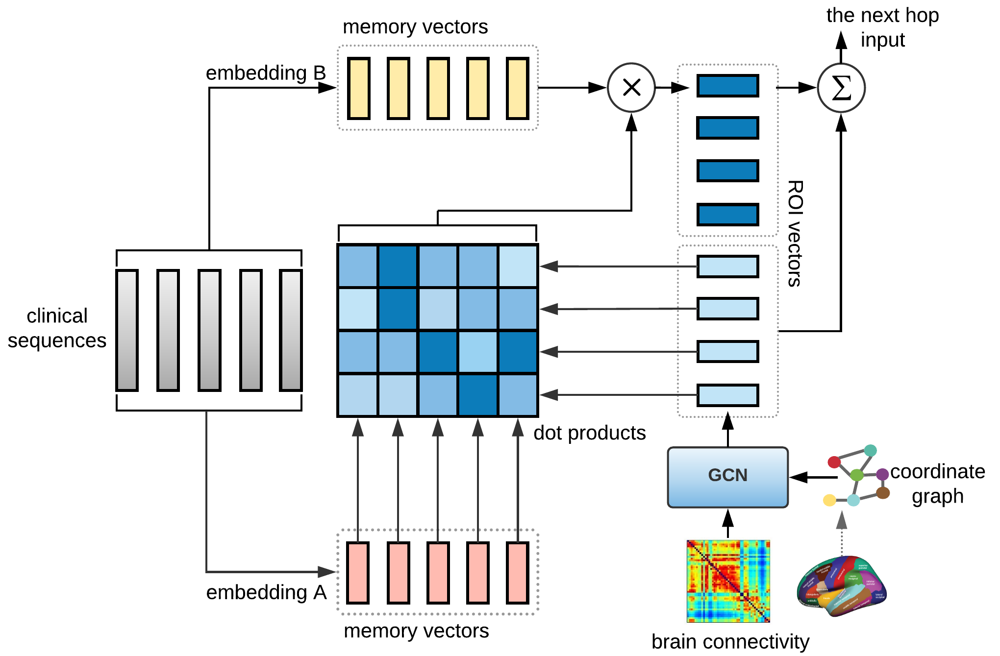

# Memory-Augmented GCN (MemGCN)

## Overview

This repository contains TensorFlow code for implementing Memory-Augmented Graph Convolutional Network multi-modal data learning in healthcare. The rationale behind the model is that both patient health records and neuroimages are important for disease understanding because of their complementary aspects of diseases.  

<p align="center"></p>

In detail, the proposed method MemGCN is a matching network embeds multi-hop memory-augmented graph convolutions and can be trained in an end-to-end fashion with stochastic optimization. The brain connectivity graphs are transformed by graph convolutional networks into representations, while the external memory mechanism is in charge of iteratively (multiple hops) reading clinical sequences and choosing what to retrieve from memories so that the representations learned by graph convolution can be augmented. 

## Memory-Augmentation

<p align="center"></p>

The key contribution of MemGCN is incorporating sequential records into the representation learning of brain connectivity in terms of memories. By pushing the clinical sequences into the memories, the continuous representations of this external information are processed with brain graphs together so that a more comprehensive diagnosis could be made. The above figure is an illustration of memory augmented graph convolution in a single hop (the 1-st hop). This repository contains the [slides](https://github.com/sheryl-ai/MemGCN/blob/master/slides.pdf) we presented in ICDM 2018.

***MemGCN provides a learning strategy for multi-modality data with sequential and graph structure in general scenarios. The code is documented and should be easy to modify for your own applications.***      

## Requirements
This package has the following requirements:
* An NVIDIA GPU.
* `Python 3.x`
* [TensorFlow 1.4](https://github.com/tensorflow/tensorflow)

## Usage
### How to Run
To run MemGCN on your data, you need to: change the function of loading data in utils.py; set hyperparameters for MemGCN in memgcn.sh; run the shell script memgcn.sh
```bash
bash memgcn.sh
```

### Additional Material
There is implementations used in: 

Sainbayar Sukhbaatar, Arthur Szlam, Jason Weston, Rob Fergus, [End-To-End Memory Networks](https://arxiv.org/pdf/1503.08895.pdf), Neural Information Processing Systems (NIPS), 2015.

Michaël Defferrard, Xavier Bresson, Pierre Vandergheynst, [Convolutional Neural Networks on Graphs with Fast Localized Spectral Filtering](https://arxiv.org/abs/1606.09375), Neural Information Processing Systems (NIPS), 2016.

Sofia Ira Ktena, Sarah Parisot, Enzo Ferrante, Martin Rajchl, Matthew Lee, Ben Glocker, Daniel Rueckert, [Distance Metric Learning using Graph Convolutional Networks: Application to Functional Brain Networks](https://arxiv.org/abs/1703.02161), Medical Image Computing and Computer-Assisted Interventions (MICCAI), 2017.


## References
If you happen to use our work, please consider citing our paper: 
```
@inproceedings{zhang2018integrative,
  title={Integrative Analysis of Patient Health Records and Neuroimages via Memory-based Graph Convolutional Network},
  author={Zhang, Xi and Chou, Jingyuan and Wang, Fei},
  booktitle={2018 IEEE International Conference on Data Mining (ICDM)},
  pages={767--776},
  year={2018},
  organization={IEEE}
}
```
This paper can be accessed on : [Memory-based GCN] (https://arxiv.org/pdf/1809.06018.pdf)
